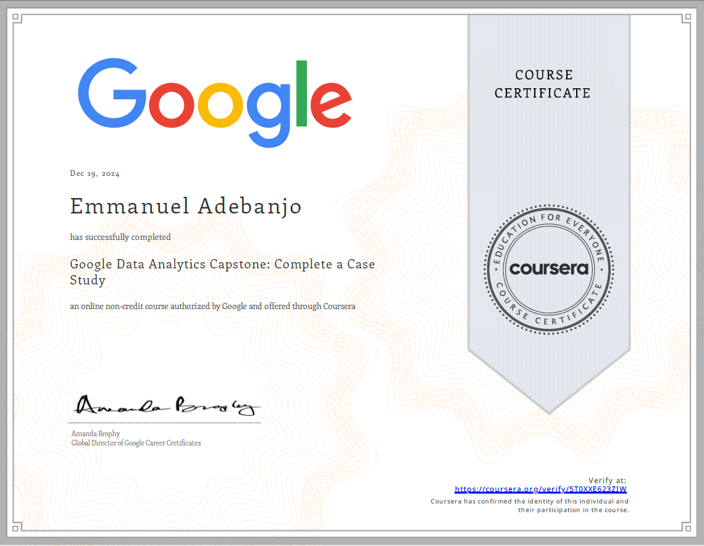
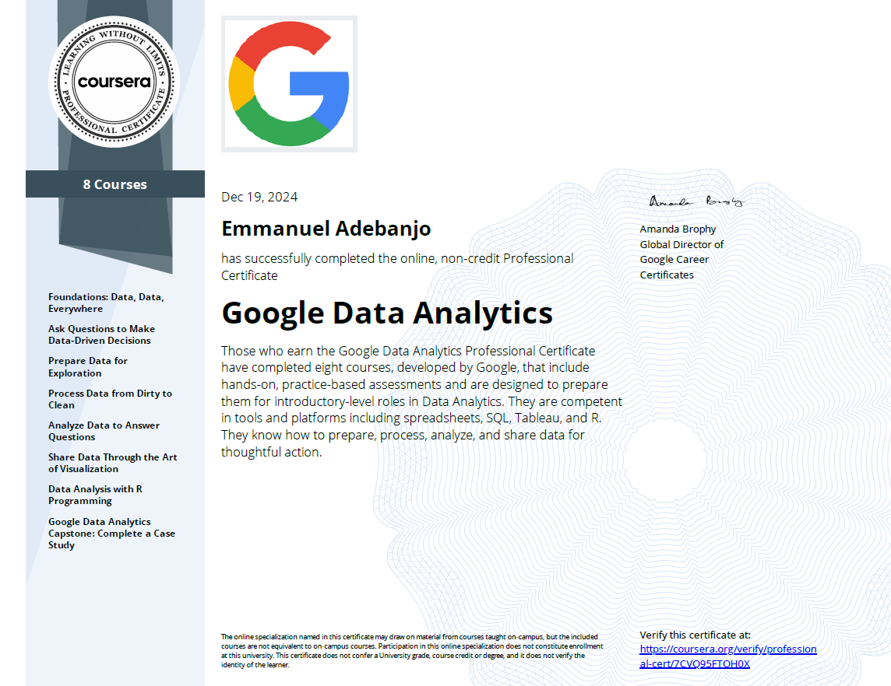

# Google Data Analytics Professional Certification Capstone: Case Study

This repository presents a capstone project derived from the Google Data Analytics Professional Certificate Course provided by Coursera. The project encompasses a well-defined objective, comprehensive data analysis, actionable recommendations, and innovative solutions tailored to Cyclistic, a bike-share company headquartered in Chicago. The insights gained from this analysis will empower Cyclistic’s marketing team to devise targeted strategies to encourage casual riders to subscribe to annual memberships. This strategic approach will contribute to enhancing customer retention and, consequently, revenue generation. 

To go straight to the PowerPoint presentation, click [HERE](./presentation/powerpoint_presentation.md)

To view Pivot Table Analysis, click [HERE](./cyclistic_case_study/pivot_table_analysis.md)

## Certification of Completion

