## Table of Contents

1. [Introduction](complete_analysis.md#introduction)
2. [Business Task and Stakeholders](complete_analysis.md#business-task)
3. [Data Collection and Preparation](complete_analysis.md#data-collection-and-preparation)
4. [Data Processing and Cleaning](complete_analysis.md#data-processing-and-cleaning)
5. [Analysis](complete_analysis.md#analysis)
6. [Summary and Recommendations](complete_analysis.md#summary)
7. [Conclusion](complete_analysis.md#conclusion)


## Introduction

 Chicago-based Cyclistic is a bike-share firm that provides full-access annual subscriptions and single-ride passes. A significant percentage of riders are casual users who buy single-ride or day passes, even though yearly memberships offer a more reliable source of income. The primary business goal is to increase annual memberships by converting casual riders into members.
 
## Business Task and Stakeholders

### Business Task:
To determine how casual riders and annual members use Cyclistic differently.

> **Goal**: This analysis aims to identify key differences in riding behavior between casual riders and annual members and provide data-driven recommendations to help the marketing team develop strategies that encourage casual riders to become members.
The insights gained from this analysis will help Cyclistic’s marketing team develop targeted strategies to encourage casual riders to purchase annual memberships, increasing customer retention and revenue.

### Stakeholders:
1. Director of Marketing: Lily Moreno
2. Cyclistic Executive Team

### Key Business Questions:
1.	What are casual riders' usage patterns and riding behaviors compared to annual members?  (e.g., trip duration, frequency, time of day, and station usage)
2.	When and where do casual riders use Cyclistic bikes the most? (e.g., peak hours, popular routes, and seasonal trends)
3.	What factors could influence casual riders to become members?
4.	What trend can help influence marketing strategies? 


## Data Collection and Preparation
* **Source:**  [Cyclistic historical trip data](https://divvy-tripdata.s3.amazonaws.com/index.html) has been made available by Motivate International Inc. and has been protected under the data-privacy license mentioned here: [license](https://ride.divvybikes.com/data-license-agreement).
* The data range used for this study and analysis was December 2023–November 2024.
* This publicly available dataset can be used for studying the usage of Cyclistic bikes by various customer types. We are unable to link pass purchases to credit card numbers since users are prohibited from using riders' personally identifiable information due to data privacy concerns.

### How is the data organized? 
* Each file has 13 columns, which are: ride_id, rideable_type, started_at, ended_at, start_station_name, end_station_name, start_station_id, end_station_id, start_lat, start_lng, end_lat, end_lng, member_casual
* ride_id is a unique rider ID and is used to identify each ride's data.
* rideable_type columns contain the type of bikes, such as electric bike and classic bike.
* started_at and ended_at columns contains date-time data and formatted as YYYY-MM-DD HH:MM:SS format.
* start_station_name, end_station_name, start_station_id, and end_station_id columns consists of station informations.
* start_lat, start_lng, end_lat, and end_lng, these columns contain latitude and longitude data.
* The member_casual column contains membership information: Member or Casual.


## Data Processing and Cleaning

### Tools Used

-   SQL (SQLite, DB Browser): To process and clean data for further analysis

-   Microsoft Excel: To analyze and visualize data

### Cleaning and Transformation of Data

* Formatted all cells to the appropriate format. e.g formatted “starte_at” and “ended_at” to date time format
* Used Excel to check for and remove duplicate rows by selecting "Remove Duplicate" in the Data tab.
* checked for and deleted null values in relevant columns.

```{sql eval=FALSE, include=FALSE}
DELETE
 FROM full_year
WHERE ride_id IS NULL or rideable_type IS NULL
 OR started_at IS NULL or ended_at IS NULL or
start_station_name IS NULL or start_station_id IS NULL
OR end_station_name IS NULL or end_station_id IS NULL
OR start_lat IS NULL or start_lng IS NULL or end_lat IS NULL or
end_lng IS NULL OR members_casual IS NULL  ;


```  
* To assist in analysis, 2 new columns were added: ride_length (calculates the length of each ride) and day_of_week (calculates the day of the week each ride started.
* All 12 months of data were uploaded to the SQL server and then combined into a full-year view using the following code:
```{sql eval=FALSE, include=FALSE}

CREATE TABLE full_year AS
SELECT * FROM "jan-tripdata"
 UNION ALL
SELECT * FROM "feb-tripdata"
 UNION ALL
SELECT * FROM "mar-tripdata"
 UNION ALL
SELECT * FROM "apr-tripdata"
 UNION ALL
SELECT * FROM "may-tripdata"
 UNION ALL
SELECT * FROM "jun-tripdata"
 UNION ALL
SELECT * FROM "jul-tripdata"
 UNION ALL
SELECT * FROM "aug-tripdata"
 UNION ALL
SELECT * FROM "sep-tripdata"
 UNION ALL
SELECT * FROM "oct-tripdata"
 UNION ALL
SELECT * FROM "nov-tripdata"
 UNION ALL
SELECT * FROM "dec-tripdata";

```   
* After joining the 12-month data, the COUNT() function was used to check the total row count of the aggregated dataset. There are 4244722 rows in this dataset.
   
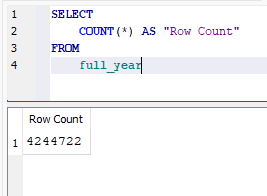


## Analysis

### Total ride share 

```{sql eval=FALSE, include=FALSE}
SELECT
 members_casual, count(ride_id) AS Total_rides
FROM full_year
GROUP BY members_casual
```

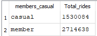

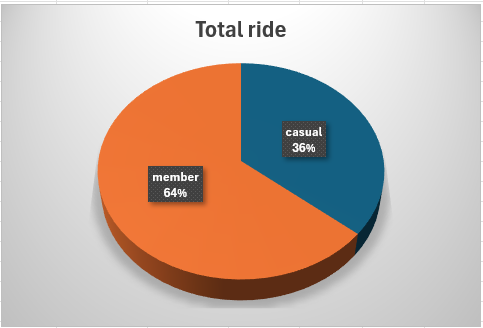

* 64% of Cyclistic's record of over 4.2 million rides over 12 months which is equivalent to 2,714,638 rides came from members.
* The remaining 34% being casual riders which accounts for 1,530,084 rides.


### Monthly distribution of the number of rides

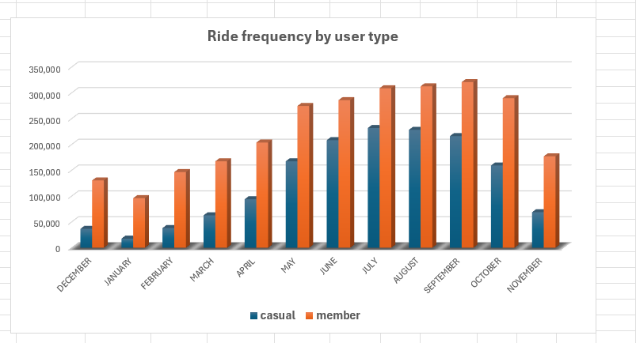

* There is a rise in all members riding in the warmer months and a fall in the cooler ones.
* The warmer months of spring and summer see a spike in casual ridership.


### Weekly distribution of the number of rides

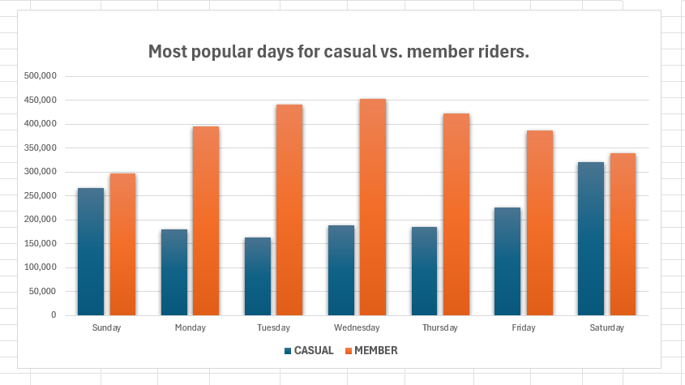

* Members travel more throughout the week.
* Casual ridership is at its highest on weekends compared to that of members, indicating that casual riders use the service more frequently on weekends.
* This indicates that casual riders use the services for leisure purposes and members leaning towards official purposes or any purpose related to work, duty, or obligations.

### Monthly distribution of the average ride duration

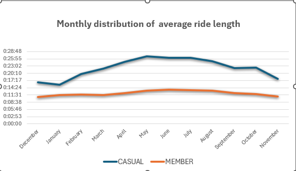

### Weekly distribution of the average ride duration

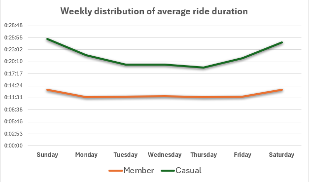

* Compared to members, casual riders ride less frequently yet take longer trips.
* Casual riders average ride duration is almost twice that of the members. 
* The average ride duration of both type of riders increase on weekends.
* Over the span of 12 months, the average ride duration by casual riders increases, gets to a peak and then starts to drop during winter as compared to that of members which remains relatively flat.


## Most frequent bike type 
#### **Classic bike**

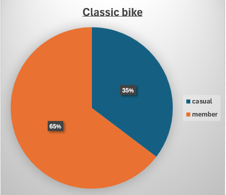

* For classic bikes, members account for 65% of the rides while casual riders is 35%.

#### **Electric bike**

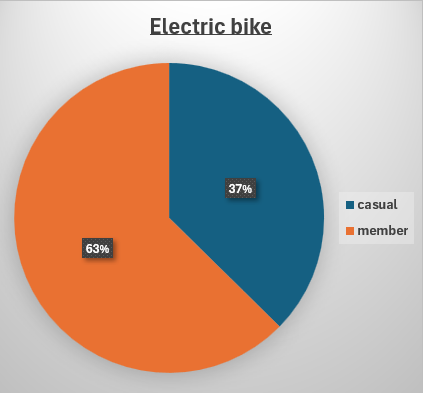

* 37% of electric bike usage are casual riders while the other 63% are members.
  
#### **Classic Bike VS Electric Bike**

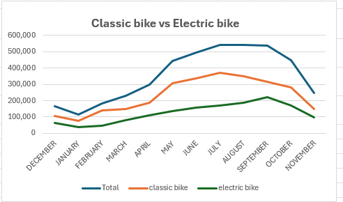

* Overall, there are more classic bike rides throughtout the year than electric bike rides.
* There is an overall increase in the months of April, May ,June, July, August and a drop starting from September, this is directly releated to a rise in all members riding in the warmer months and a fall in the cooler ones.

### Total ride by bike type and member type 

```{sql eval=FALSE, include=FALSE}
SELECT members_casual, COUNT(*) AS total_rides,
 rideable_type,COUNT(*) AS ride_type
FROM "full_year"
GROUP BY members_casual, rideable_type
```

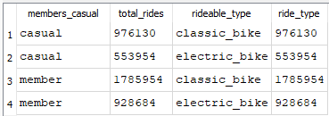

* Both members and casual riders tend to prefer classic bikes over electric bikes.
* There are 553,954 electric bikes and 976,130 classic bike rides for casual riders.
* There were 928,684 member electric bike rides as opposed to 1,785,954 classic bike rides.
* Demands for classic bikes rises during the months when the number of casual riders increases. 


### Most frequently used stations for starting and ending rides. 

#### **Top 10 start station**
```{sql eval=FALSE, include=FALSE}
SELECT start_station_name, COUNT(*) AS total_rides
 FROM "full_year"
WHERE start_station_name IS NOT NULL
 GROUP BY start_station_name
 ORDER BY total_rides DESC
LIMIT 10;
```

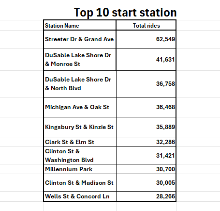

#### **Top 10 end station**
  
```{sql eval=FALSE, include=FALSE}
SELECT end_station_name, COUNT(*) AS total_rides
 FROM "full_year"
WHERE end_station_name IS NOT NULL
GROUP BY end_station_name
ORDER BY total_rides DESC
LIMIT 10;
```

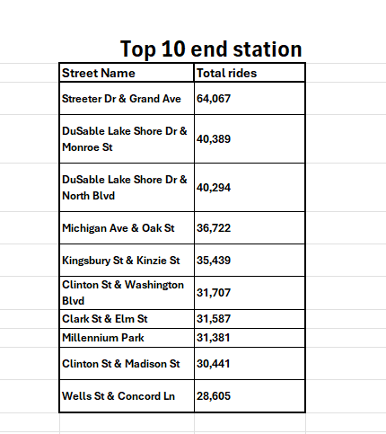

* There is a similarity between the top 10 start stations and the top 10 end stations for all the total rides.

#### **Most popular start stations for casual riders**

```{sql eval=FALSE, include=FALSE}
SELECT 
start_station_name, count(ride_id) AS Total_rides
 FROM full_year
WHERE members_casual = 'casual'
GROUP BY start_station_name
ORDER BY Total_rides DESC
LIMIT 10;
```

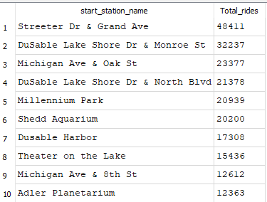

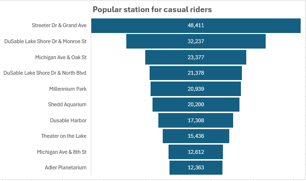

#### **Most popular start stations for member riders**

```{sql eval=FALSE, include=FALSE}
SELECT 
start_station_name, count(ride_id) AS Total_rides
 FROM full_year
WHERE members_casual = 'member'
GROUP BY start_station_name
ORDER BY Total_rides DESC
LIMIT 10;
```

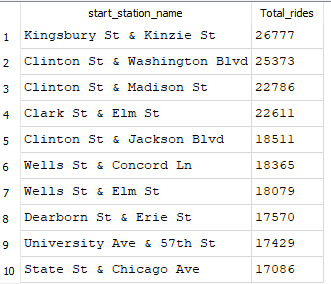

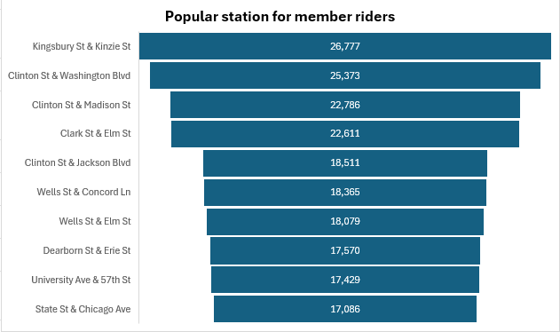


#### **Most frequent routes start - end station**

```{sql eval=FALSE, include=FALSE}
SELECT
 start_station_name,
 end_station_name,
 count(ride_id) AS Total_rides
FROM full_year
WHERE start_station_name IS NOT NULL
AND end_station_name IS NOT NULL
GROUP BY start_station_name, end_station_name
ORDER BY Total_rides DESC
LIMIT 10;
```

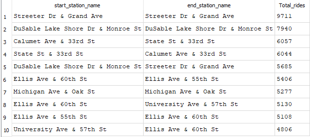

* Analysis indicates that the most favorite start stations for casual riders are different from those for members which indicates that this two group of riders have different locations where they tend to ride from. 


## Summary and Recommendations

### Summary of Analysis

 The key business question here was to identify the differences between usage pattern between the 2 types of rider (casual and annual members) of Cyclistic. Following an in-depth analysis, it was discovered that 64% of Cyclistic's record of over 4.2 million rides over 12 months came from members, with the remaining 34% being casual riders. Additionally, casual riders travel farther yet ride less frequently than members, the data shows that the average ride length of casual riders was always higher than that of members throughout the 12 months. 

 Casual ridership is at its highest on weekends, indicating that casual riders use the service more frequently on weekends even while members travel more throughout the week. Another conclusion is that the warmer months of spring and summer see an increase in casual ridership. Additionally, it was observed that a rise in all members riding in the warmer months and a fall in the cooler ones. 

 Additionally, classic bikes are typically preferred over electric bikes by both members and casual riders. According to the data, there are 553,954 electric bikes and 976,130 classic bike rides for casual riders and there were 928,684 member electric bike rides as opposed to 1,785,954 classic bike rides. The demand for classic bike rides is likewise directly correlated with the quantity of rides. Demands for classic bikes also rise during the months when the number of casual riders increases. 

 Finally, the most popular routes, or start-to-end stations, are correlated with the similarity between the top 10 start stations and the top 10 end stations for all rides. However, upon closer inspection, it was found that the most favorite stations for casual riders are different from those for members which indicates that this two group of riders have different locations where they tend to ride from. 

### Recommendations

Based on my analysis, my top three recommendations will be: 
•	Offer discounts on annual memberships for frequent casual riders and Promote weekend membership benefits to casual users.
•	Increase bike availability and targetted on-ground marketing at locations most frequently used by casual riders.
•	Run targeted marketing campaigns in warmer months.

### Innovative Solutions

•	**Targeted marketing campaigns -** The targeted marketing campaigns for Cyclistic can be designed to increase annual membership by focusing on specific strategies during the warmer months such as offering discounts,promoting weekendbenefits and increasing bike availability in locations most frequently used by riders. 

•	**Personalized engagement -** Implementing personalized communication and engagement strategies to make members feel valued and connected to the Cyclistic community.

•	**Loyalty program -** Introducing loyalty programs that reward long-term members with exclusive benefits, discounts, and special offers.

•	**Enhanced services -** Continuously enhancing the services offered to members, such as improving bike availability, maintaining high-quality bikes, and ensuring convenient station locations.

•	**Feedback mechanisms -** Establishing robust feedback mechanisms to gather insights from members about their experiences and preferences and using this feedback to make continuous improvements.

• **Community building -** Creating a sense of community among members through events, social media engagement, and member-exclusive activities.

***These strategies aim to convert occasional riders into full members, thereby boosting annual memberships and enhancing overall user engagement.***

## Conclusion

  In conclusion, the objective was to understand engagement patterns of annual members and infrequent riders to boost annual memberships by converting occasional riders into full members. After analysis, data findings show differences in ride lengths between casual and member riders, with members having longer average ride lengths. Casual riders prefer classic bikes, especially in warmer months. Popular ride stations for both groups are listed, with Streeter Dr & Grand Ave being the most popular. As per these observations, recommendations include offering discounts on annual memberships for frequent casual riders, increasing bike availability at popular locations, and running targeted marketing campaigns in warmer months. In the case of future analysis, future analysis will focus on product enhancement, reasons for preference of classic bikes over electric bikes, improving station placement to boost sales, and understanding similarities between top 10 start and end stations. :smiley:


