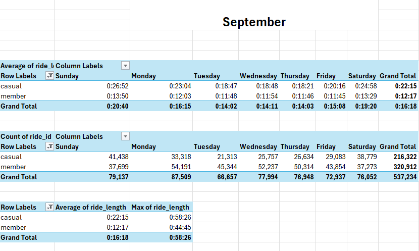

## Pivot Table

In this project, I used Excel Pivot Tables to find cool trends and patterns hidden in Cyclistic's 12 months of raw data. By putting the raw data into dynamic summaries, I could quickly spot trends, outliers, and performance metrics without writing any code. With just a few clicks, I turned a ton of information into a clear, interactive summary that told the story behind the numbers. 

This presentation shows you how Pivot Tables can be super useful for quickly and easily exploring data. It’s perfect for early-stage data analysis or when you need quick business intelligence. Even simple tools can give you valuable insights and help you make better decisions.

This pivot table analysis shows the average ride length and number of rides for each day of the week, from December 2023 to November 2024. It also includes the average ride length and maximum ride length for both casual and member riders.

Here is a screenshot of all 12 months' quick analysis I got using Pivot Table: 

